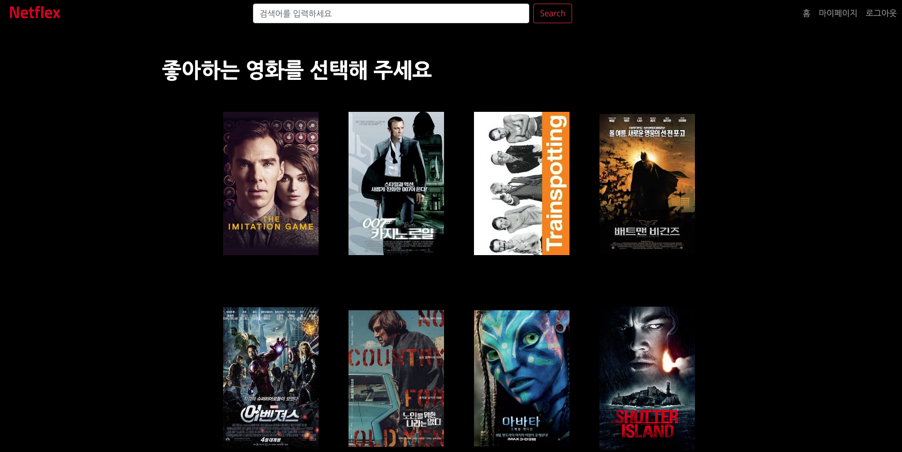
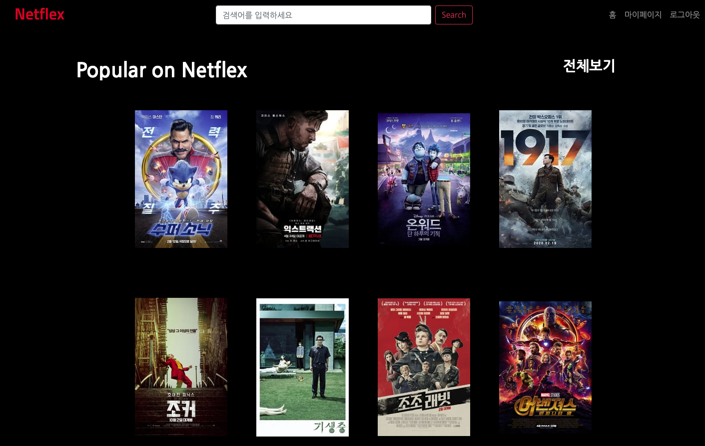
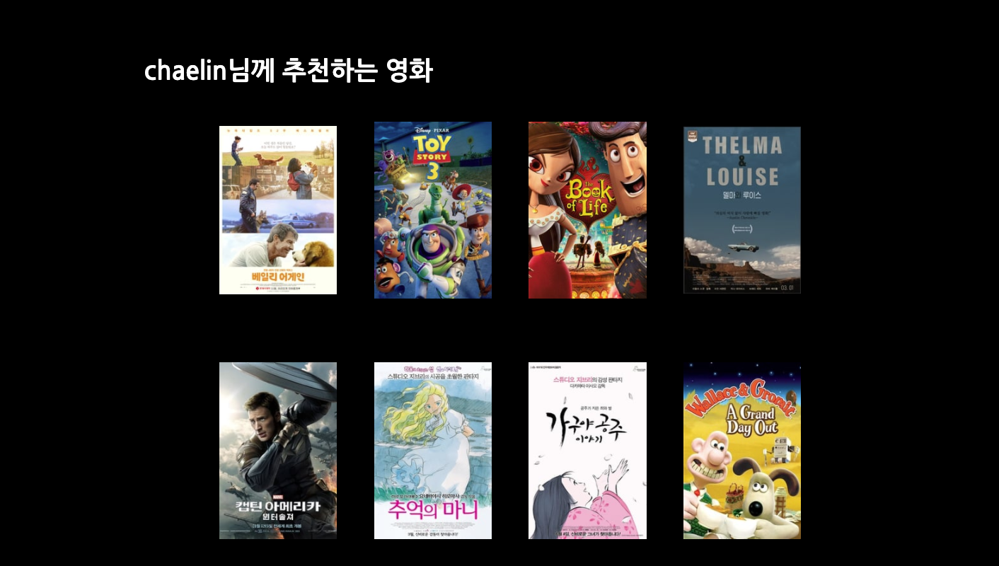
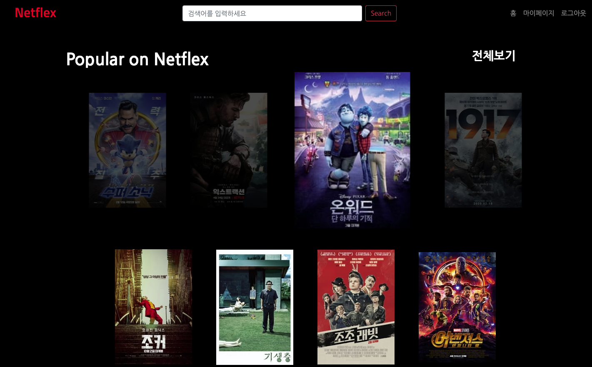
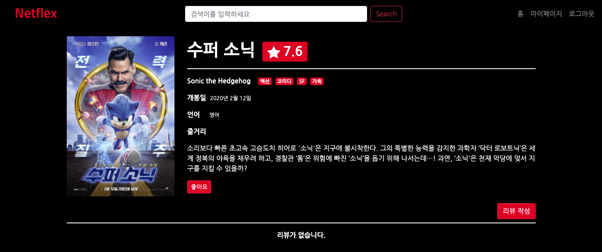
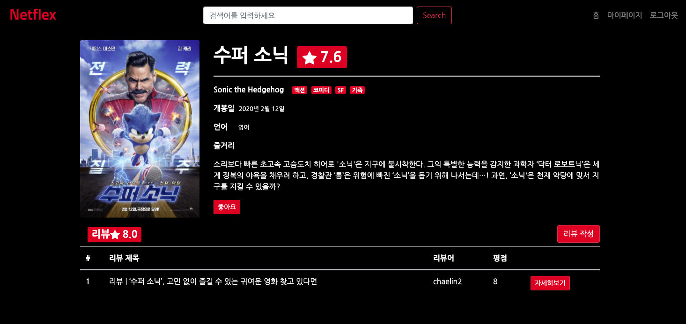
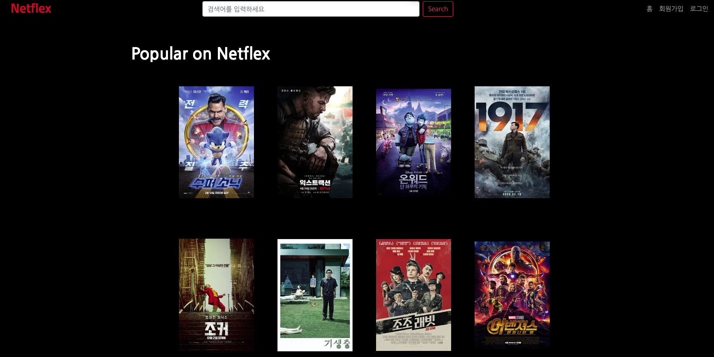
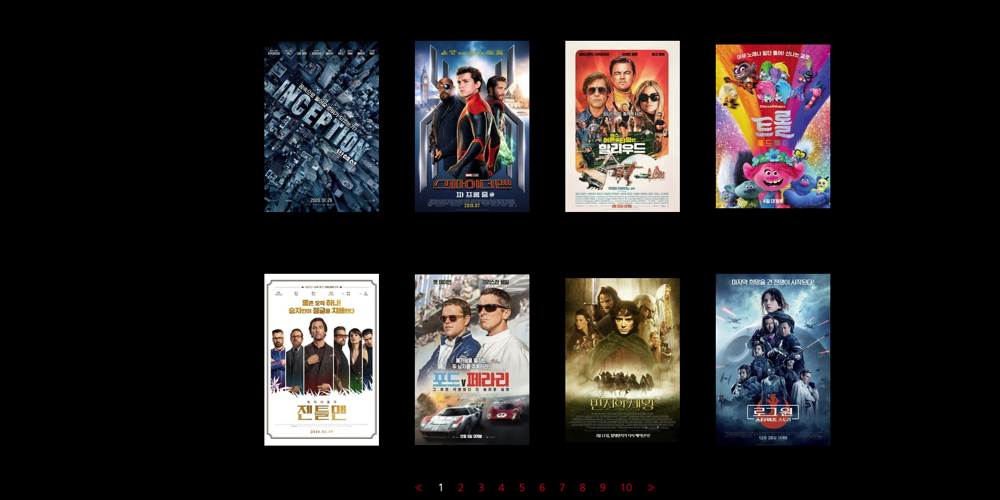
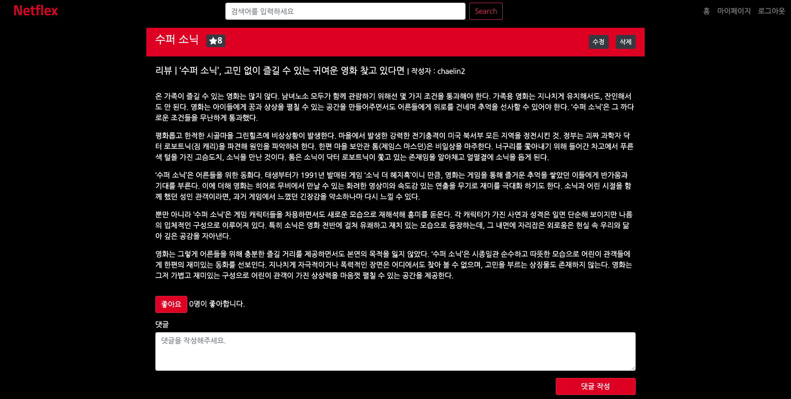

# Django-pjt5

## 구현항목

### 01. 프로젝트 구조

- 프로젝트 이름은 django_pjt5 입니다.
- 앱 이름은 `movies`입니다. 

<br>

### 02. 필수 기능

- 모든 사용자가 영화데이터를 조회 가능합니다. 
- 영화 데이터 목록을 표시할 때, 한 페이지에 모든 데이터를 표시하지 않습니다. (https://docs.djangoproject/com/en/3.0/topics/pagination/#using-paginator-in-a-view-function) 
- 인증된 사용자만 취향에 맞는 영화를 '좋아요' 할 수 있습니다. '좋아요'의 활성화/비활성화는 AJAX 요청을 사용 해야 합니다. 
- 인증된 사용자에게 10개의 영화를 추천하여 제공합니다. 

<br>

### 03. 가상환경 구축

#### 1) 프로젝트 생성

```bash
$ mkdir django_pjt5
$ cd django_pjt5
```

#### 2) 가상(독립) 환경 설정

가상환경 생성 및 실행

```bash
$ python -m venv venv
$ source venv/bin/activate
```

#### 3) 패키지 설치

Django 관련 패키지 및 배포를 위한 패키지 설치

```bash
$ pip install django django-extensions django-bootstrap4
```

#### 4) Django 프로젝트 생성

Django 프로젝트 생성

```bash
$ django-admin startproject django_pjt5
```

<br>

### 04. Modeling

- 제공된 데이터를 사용하기 위해 필수로 구현해야 하는 모델은 다음과 같습니다. 아래 모델들( Genre , Movie )은 반 드시 movies app 안에 정의되어야 합니다. (아래 모델링에 대응하는 DB 테이블이 없을경우, loaddata 가 불가 능 합니다.)

> 본격적으로 프로젝트를 시작하기 전, 각 모델에 무슨 필드가 들어갈지 조원 3명이 함께 상의하였습니다.
>
> 서로 상의한 결과, 아래와 같이 구성하였습니다.

#### User

- email
- password
- first_name
- last_name
- username
- followers
- is_staff
- movies

#### Movie

- title
- original_title
- popularity 
- release_date
- vote_count
- vote_average
- adult
- overview
- original_language
- poster_path
- backdrop_path
- genres
- like_users

#### Review

- movie
- user
- title
- content
- rank
- created_at
- updated_at

#### Comment

- review와 1:N
- author
- content
- created_at
- updated_at

#### Genre

- movie와 1:N

- name

<br> movies의 칼럼이 지난 프로젝트와 달라졌습니다. 

영화 데이터는 https://themoviedb.org API 에서 TOP-rated 영화를 기반으로 만들어 졌습니다. 그리고 image 경로가 서버에 저장된 이미지를 사용하는 것이 아니라 API 서버에 저장된 파일을 불러오기 위한 경로를 저장하는 문자열 `poster_path`를 사용합니다. `poster_path` 를 사용하려면, https://image.tmdb.org/t/p// 의 URL 로 요청을 보내야 합 니다.  로 사용할 수 있는 사전정의된 문자열은 ["w92", "w154", "w185", "w342", "w500", "w780", "original"] 입니다. 사전정의되지 않은 사이즈는 사용할 수 없습니 다. (https://developers.themoviedb.org/3/getting-started/images)

[관련 API 문서]: https://developers.themoviedb.org/3/movies/get-top-rated-movies	"movie API"

<br>

### 05. LoadData

```
./manage.py loaddata .json
```

migrate를 완료한 이후 더미데이터를 추가해 준다.

<br>

### 06. 회원가입시 영화 좋아요 조사

회원가입을 하고 나면 `recommendation`으로 redirect됩니다. 해당 페이지에서는 임의로 20개의 영화를 보여주고 사용자가 좋아하는 영화를 선택하게 만들어 줍니다. 10개 이상 선택했을 경우 `alert`알림을 통해 알려줍니다.

##### 1) urls.py

```python
urlpatterns = [
    path('recommendation/', views.recommendation, name='recommendation'),
    path('<int:movie_pk>/like/', views.like, name='like'),
]
```

##### 2) `like` logic

- 좋아요를 처리하는 과정은  `Ajax`통신을 이용해 구현됩니다. 먼저 `recommedation.html`페이지가 렌더링 될 때 각 이미지에 `EventListener`를 부착해 `like`로직을 처리할 수 있게 만들어 줍니다. 좋아요 선택을 받은 영화는 이미지의 `style`속성의 opacity 속성을 변경합니다. 

- :rotating_light:어려웠던 점
  - 영화 포스터 이미지에 \<a> 태그와 `EventListener`를 동시에 추가하자 비동기 처리가 되고 나서 페이지가 다시 렌더링었습니다. \<a> 태그를 삭제함으로써 문제를 해결했습니다.

<br>

### 07. 영화 추천 서비스:star:

- 회원가입을 할 때 좋아요 표현을 한 영화들을 대상으로 장르를 조사합니다. 그리고 선택된 `Movie`들의 `genre`가 각각 몇번 등장하는지 체크합니다. 

```python
genre_dict = {'Drama' : 0, 'Thriller':0, 'Comedy': 0, 'Action': 0, 'Science Fiction': 0, 'Family': 0, 'Fantasy': 0,
            'Animation': 0, 'Adventure': 0, 'History': 0, 'War': 0, 'Crime': 0, 'Horror': 0, 'Mystery': 0, 'Western': 0, 'Music': 0, 'Documentary': 0}
            for like_movie in like_movies:
                for genre in like_movie.genres.all():
                    genre_dict[genre.name] += 1
```

- 가장 많이 등장한 3개의 `genre`를 포함하는 영화들 집합을 저장한 다음 임의로 8개를 선정해 사용자에게 보여줍니다. 

```python
genre_dict = dict(reversed(sorted(genre_dict.items(), key=lambda g : g[1])))
            like_genres = []
            for idx, key in enumerate(genre_dict):
                if idx == 3:
                    break
                like_genres.append(key)
            recommendation_movies = set()
            for i in range(3):
                recommendation_movies = recommendation_movies | set(Genre.objects.get(name=like_genres[i]).genre_movies.all())
            import random
            recommendation_movies = random.sample(recommendation_movies, 12)
```

- 다음은 

<br>

### 08. 마이페이지 UI 수정

- 기존 코드의 마이페이지에서 작성한 글이나, 좋아요 한 글이 없는데도 작성한 글, 좋아요 한 글 헤더들이 남아있는 점이 화면 상에서 이상하게 보여습니다.
- 그래서 if문을 사용하여 사용자에게 '작성한 글이 없습니다.', '좋아요 한 글이 없습니다.' 라고 보여줄 수 있도록 추가하였습니다.

<br>

### 09. Index 페이지

- Index 페이지에는 `Popular on Netflex`와, `____님께 추천하는 영화`를 보여줄 수 있도록 화면을 구성했습니다.

##### 1) 구성

- Popular on Netflex에는 `popularity` 필드를 내림차순으로 정렬하여, popularity가 높은 순으로 총 8개를 구성하였습니다.

  - views.py

    - ```python
      movies = Movie.objects.order_by('-popularity')[:8]
      ```

  - 인기 순으로 더 많은 영화들을 보고싶은 사용자들을 위해 `전체보기`를 만들어 이를 클릭하면 popular 페이지로 넘어갈 수 있도록 하였습니다.

- 그 하단에는, 만약 사용자가 로그인이 되어 있고, 추천 영화를 선택했다면, `____님께 추천하는 영화`가 나올 수 있도록 만들었습니다.
  - 추천 영화는 위에서 언급한 영화 추천 서비스의 알고리즘을 이용해 가져온 8개의 영화입니다. 
  - 추천 영화 역시 총 8개로 구성되도록 만들었습니다.

##### 2) carousel

- carousel의 기본 html 코드는 다음과 같습니다.

  - ```html
    <div class="main d-flex justify-content-center">
      <div class="row d-flex justify-content-center">
        <div class="row-inner">
            <div class="tile col-3">
                <div class="tile-media">
                  </a>
                </div>
            </div>
        </div>
      </div>
    </div>
    ```

- 위 코드에, 4개씩 carousel을 보여주기 위해 DTL의 filter `slice`를 활용하여 4개씩 끊었습니다. 

- 자세한 코드는 아래를 참고하시면 됩니다.

  - ```html
    <div class="main d-flex justify-content-center">
      <div class="row d-flex justify-content-center">
        <div class="row-inner">
          
            <div class="tile col-3">
                <div class="tile-media">
                  <a href=""></a>
                </div>
            </div>
          
        </div>
      </div>
    </div>
    <div class="main d-flex justify-content-center">
      <div class="row d-flex justify-content-center">
        <div class="row-inner">
          
            <div class="tile col-3">
                <div class="tile-media">
                  <a href=""></a>
                </div>
            </div>
          
        </div>
      </div>
    </div>
    ```

- 이에 더해 각종 효과를 주기 위해 css를 사용하였습니다.

  - ```css
    .main {
      padding: 0 10px;
      margin: 0;
      background: black;
      color: #ecf0f1;
      display: flex;
      flex-direction: row;
      align-items: center;
      width: 100%;
    }
    
    .row {
      overflow:hidden;
      width:100%;
    }
    
    .row-inner {
      white-space: nowrap;
      transition: 0.45s all;
      margin: 50px 10px;
    }
    
    .tile {
      position: relative;
      display:inline-block;
      margin: 0 5px;
      transition: 0.45s all;
      transform-origin: left center;
    }
    
    img {
      object-fit:cover;
    }
    .row-inner:hover
    {
      /*move to the left */
      transform: translateX(calc(250px*(-0.5)/2));
    }
    
    .row-inner:hover .tile {
      opacity: .3;
    }
    
    .row-inner:hover .tile:hover {
      /*set opacity back to 1 */
      transform: scale(1.5);
      opacity: 1;
    }
    
    .tile:hover ~ .tile {
      /* move tiles on the right to the right*/
      transform: translateX(calc(250px * 0.5));
    }
    ```

##### :rotating_light:어려웠던 점

- CSS 파일을 적용하는 방법을 잊어버려서 찾아봤습니다.

- 폴더 구조는 잊지 않고, 잘 적용했으나 를 이용하는 것을 잊어 한참을 헤맸습니다.

  - ```html
    
    	<link rel="stylesheet" href="">
    
    ```

<br>

### 10. Recommendation 페이지

- 회원가입 직후 보여주는 recommendation 페이지에서 뽑는 추천 영화는 다음과 같은 방법으로 영화를 뽑은 것입니다.
- 먼저, `popularity`를 기준으로 영화를 100개를 뽑고, 그 이후 `random.sample`로 랜덤하게 20개의 영화를 뽑아 사용자에 보여주는 방식으로 만들었습니다.

- ```python
  @login_required
  def recommendation(request):
      user = request.user
      if user.like_movies.all():
          return redirect('movies:index')
      import random
      movies = Movie.objects.order_by('-popularity')[:100]
      random_movies = random.sample(list(movies), 20)
      context = {
          'random_movies': random_movies,
          'count': user.like_movies.count(),
      }
      return render(request, 'movies/recommendation.html', context)
  ```

  

<br>

## 구현 화면

### 회원가입 화면


### 로그인 화면


### 회원가입 직후 좋아하는 영화 선택




### 로그인 후 메인 화면 (상단: 인기 순)




### 로그인 후 메인 화면 (하단: 사용자 추천)

> 유저가 로그인 하지 않았다면 추천 영화는 보이지 않습니다.




### 로그인 후 메인 화면 (마우스오버 시 효과)




### 마이페이지

> 작성한 글과 좋아요 한 글이 없을 시 메시지가 나오도록 만들었습니다.


### 영화 상세 페이지 (리뷰 없을 시)




### 영화 상세 페이지 (리뷰 있을 시)




### Popular  (+ Pagination)






### 리뷰 페이지



